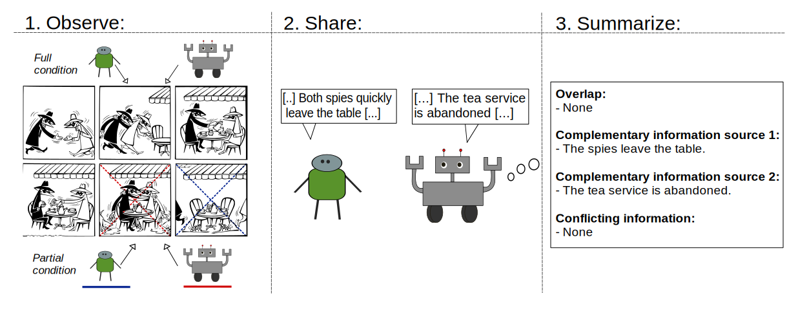

# Human-Agent Co-construction of Episodic Memories
This repository contains the code used for the paper "Human-Agent Co-construction of Episodic Memories", published at [HHAI 2025](https://hhai-conference.org/2025/). It explores to what extent an LLM can be used to align different accounts of the same event memories, identifying overlapping, complementary, and conflicting information.

  

