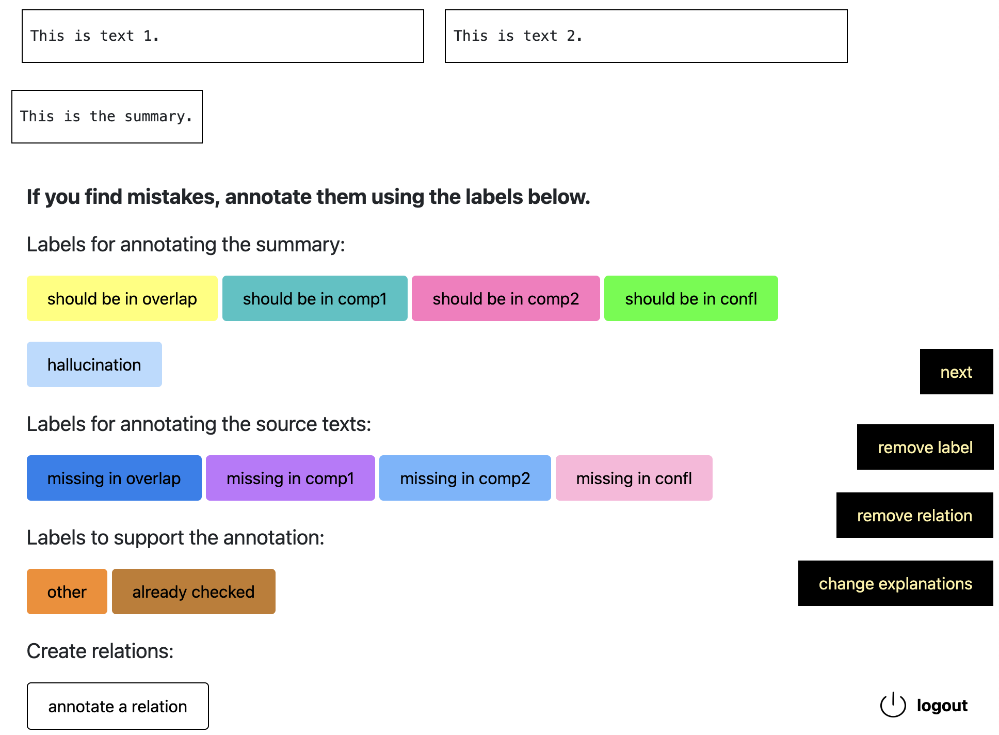

# Text Annotation Tool 
This text annotation tool was used for annotations relating to the paper "Human-Agent Co-construction of Episodic Memories", published at [HHAI 2025](https://hhai-conference.org/2025/). It is an adaptation of a tool developed as part of the [CLARIAH](https://www.clariah.nl) consortium, available [here](https://github.com/cltl/span-annotation-tool/tree/main).

  

# How to Use
For instructions on required dependencies and on how to run the app, see the [original repository](https://github.com/cltl/span-annotation-tool/tree/main). 

# Features Added 
This version of the tool includes a number of additional features / changes:
- Annotators can define relations between annotated spans, these become visible when hovering over one of the spans
- Annotators can pick any individual annotation and remove it
- Annotators can change the explanation they have given for choosing the OTHER tag
- Annotations created on the current sample are saved when the user navigates to a previous sample
- The samples the tool excepts should contain three text fields (Text1, Text2, Summary) instead of one